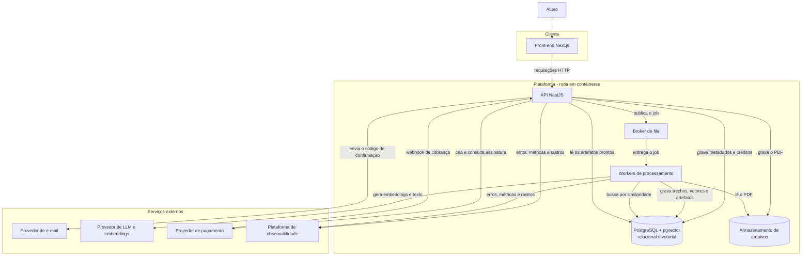
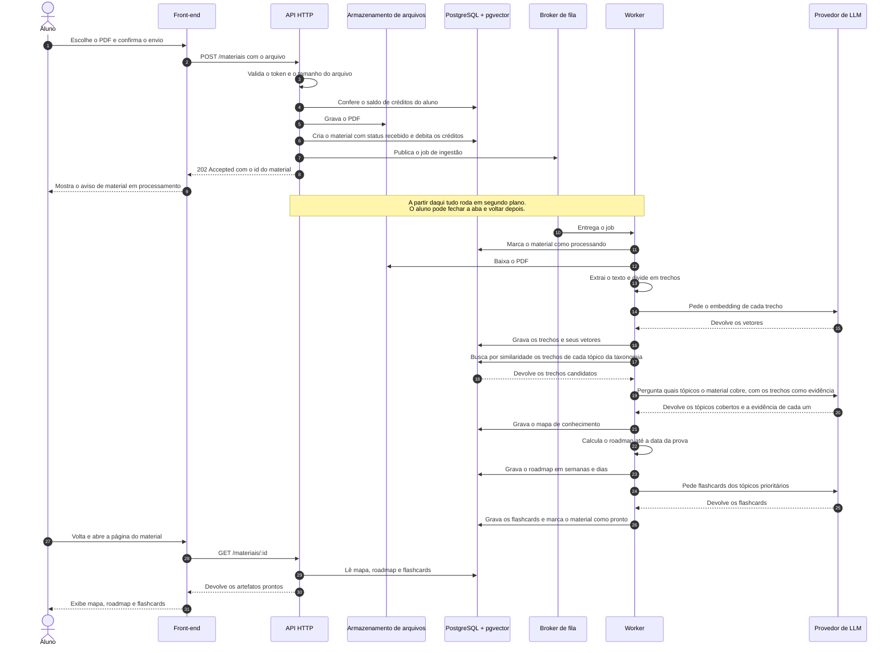
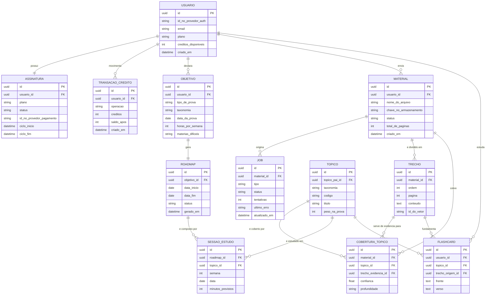
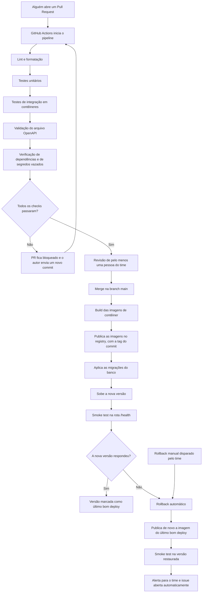

# Your Journey

Plataforma de plano de estudos adaptativo. O aluno informa seu objetivo e envia o
material real que precisa dominar. A plataforma processa esse material em segundo
plano e devolve três artefatos prontos: um **mapa de conhecimento**, um **roadmap de
estudos** até a data da prova e um conjunto de **flashcards**.

Projeto acadêmico da disciplina de Engenharia de Software. Entrega em **21 de outubro de 2026**.

> **Como ler este README.** Ele foi escrito para um time com integrantes iniciantes.
> Todo termo técnico é explicado na primeira vez que aparece, e existe um
> [glossário](#23-glossário) no final. Se um trecho parecer óbvio demais, pule. Se
> parecer difícil demais, o glossário provavelmente resolve.

> **Estado atual.** A estrutura inicial está de pé: front-end, API e banco sobem com
> um comando. O que já existe e o que ainda não existe está em
> [1.1](#11-o-que-já-existe-neste-repositório).

> **Sobre o que ainda não foi decidido.** Parte da stack já foi fechada e está em
> [10. Stack](#10-stack). O que ainda não foi decidido aparece como `<A DEFINIR>`, com
> o critério de decisão ao lado. Isso é proposital: documentar uma escolha que ninguém
> fez é pior do que assumir que ela está em aberto.

---

## Sumário

1. [Visão geral](#1-visão-geral)
2. [O problema](#2-o-problema)
3. [O que a plataforma entrega](#3-o-que-a-plataforma-entrega)
4. [Por que não é um chatbot](#4-por-que-não-é-um-chatbot)
5. [Escopo do MVP](#5-escopo-do-mvp)
6. [Requisitos da avaliação](#6-requisitos-da-avaliação)
7. [Arquitetura](#7-arquitetura)
8. [Fluxo de ingestão de material](#8-fluxo-de-ingestão-de-material)
9. [Como o RAG funciona](#9-como-o-rag-funciona)
10. [Stack](#10-stack)
11. [Modelo de dados](#11-modelo-de-dados)
12. [Como rodar localmente](#12-como-rodar-localmente)
13. [Variáveis de ambiente](#13-variáveis-de-ambiente)
14. [Documentação da API](#14-documentação-da-api)
15. [Estratégia de testes](#15-estratégia-de-testes)
16. [CI/CD e rollback](#16-cicd-e-rollback)
17. [Observabilidade](#17-observabilidade)
18. [Créditos e pagamento](#18-créditos-e-pagamento)
19. [Estrutura de pastas](#19-estrutura-de-pastas)
20. [Como contribuir](#20-como-contribuir)
21. [Documentação complementar](#21-documentação-complementar)
22. [Equipe e prazo](#22-equipe-e-prazo)
23. [Glossário](#23-glossário)

---

## 1. Visão geral

O aluno faz três coisas na plataforma:

1. **Declara o objetivo**: qual prova vai prestar, em que data, quantas horas por
   semana tem disponíveis e quais matérias considera mais difíceis.
2. **Envia o material**: apostilas em PDF, provas anteriores, simulados, listas de
   exercícios. O material é o que ele já tem em mãos, não um conteúdo genérico da
   plataforma.
3. **Recebe os artefatos**: quando o processamento termina, ele abre a plataforma e
   encontra o mapa, o roadmap e os flashcards prontos.

Não existe conversa. Não existe caixa de mensagem. O aluno envia arquivos e recebe
documentos. Essa decisão está explicada na seção
[4. Por que não é um chatbot](#4-por-que-não-é-um-chatbot).

**Público-alvo**: quem estuda para vestibular, quem estuda para concurso público e
cursinhos que queiram organizar o material dos seus alunos.

### 1.1. O que já existe neste repositório

Este README descreve o produto inteiro. Boa parte dele ainda é plano. O que está
construído hoje:

| | Item | Milestone |
| --- | --- | --- |
| pronto | Estrutura do repositório, API e front-end separados, PostgreSQL com pgvector | 01 |
| pronto | `compose.yaml`, `Makefile` e scripts de pré-requisito e de espera | 01 |
| pronto | Configuração tipada e validada na subida da API | 01 |
| pronto | TypeORM com migrações versionadas | 01 |
| pronto | Estrutura MVC da API | 01 |
| pronto | CI no GitHub Actions, com lint, testes e **smoke test obrigatório** | 01 |
| pronto | Proteção da branch `main`, com revisão e checks obrigatórios | 01 |
| pronto | Tabela de usuários e cadastro em `/auth/cadastro`, com hash de senha | 02 |
| pronto | Usuário atual, com guarda e decorator | 02 |
| pronto | Matriz de referência do ENEM, com 154 tópicos | 03 |
| pronto | Tabela de objetivo de estudo | 03 |
| a fazer | Sessão com JWT, refresh e cookies, e confirmação de e-mail | 02 |
| a fazer | Upload de material, fila, ingestão e mapa de conhecimento | 03 |
| a fazer | Roadmap e flashcards | 04 |
| a fazer | Créditos e pagamento | 05 |
| a fazer | Deploy com rollback, e observabilidade | 06 |

Isto é um **esqueleto que anda**: pouco faz, mas atravessa o sistema de ponta a ponta —
navegador, front-end, rede interna do Docker, API e banco. Cada fatia seguinte é
construída em cima de algo que já funciona, em vez de todas as peças serem integradas
no fim, que é quando integração costuma dar errado.

---

## 2. O problema

Quem estuda para uma prova grande raramente sofre por falta de material. Sofre pelo
contrário: tem apostila demais, PDF demais, simulado demais, e tempo de menos.

Três dificuldades concretas aparecem sempre:

- **O aluno não sabe o que, do material dele, cai na prova.** Uma apostila de 400
  páginas cobre muito mais do que a matriz de referência da prova exige, e deixa de
  fora coisas que a prova cobra.
- **O aluno não sabe distribuir o tempo.** Faltam 14 semanas, ele tem 10 horas por
  semana, e não existe um critério claro para decidir o que estudar em cada uma.
- **Planos de estudo prontos da internet não conhecem o caso dele.** Eles não sabem
  qual material ele tem, qual é o edital dele, nem em que ele é pior.

O que falta não é conteúdo. É **ordenação do conteúdo que o aluno já tem**, medida
contra a prova que ele vai fazer. É exatamente esse o recorte do produto.

---

## 3. O que a plataforma entrega

| Entrada | Saída |
| --- | --- |
| Objetivo: prova, data, horas por semana, matérias difíceis | Mapa de conhecimento |
| Material: PDFs de apostilas, provas, listas | Roadmap de estudos até a data da prova |
| — | Flashcards dos tópicos prioritários |

### 3.1. Mapa de conhecimento

Uma lista de quais tópicos o material enviado cobre, comparada com uma **taxonomia
canônica**.

> **Taxonomia canônica** é a lista oficial de tópicos que a prova cobra — a matriz de
> referência do ENEM, ou o edital do concurso. É a régua. Sem uma régua externa, dizer
> que "o material cobre funções" não significa nada; comparando com a matriz, dá para
> dizer que o material cobre 7 dos 9 tópicos de Álgebra e nenhum de Estatística.

O mapa responde a duas perguntas: **o que o material cobre** e, mais importante, **o
que ele não cobre** — as lacunas que o aluno precisa buscar em outro lugar.

Cada tópico identificado carrega a **evidência** que o justificou: o trecho e a página
do material de onde a conclusão saiu. Isso permite que o aluno confira, e permite que
o time avalie a qualidade do resultado sem precisar acreditar na plataforma.

### 3.2. Roadmap de estudos

Um plano da data de hoje até a data da prova, quebrado em **semanas** e, dentro de
cada semana, em **dias**. Cada sessão de estudo aponta para um tópico do mapa e para o
trecho do material que cobre aquele tópico.

A distribuição leva em conta as horas por semana declaradas, a distância até a prova,
o peso do tópico na matriz de referência e as matérias que o aluno marcou como difíceis.

### 3.3. Flashcards

Cartões de pergunta e resposta gerados a partir dos tópicos prioritários, usando
trechos reais do material do aluno como fonte. Um flashcard sempre aponta para o
trecho que o originou.

---

## 4. Por que não é um chatbot

**Decisão de produto, deliberada.** O usuário não conversa com IA em momento nenhum.

As razões:

- **O aluno não quer conversar, quer um plano.** Quem está a 12 semanas da prova
  precisa saber o que fazer na terça-feira. Uma conversa transfere para o aluno o
  trabalho de perguntar as coisas certas — que é justamente o trabalho que ele não
  sabe fazer.
- **Artefato pode ser revisado; conversa não.** Um roadmap é um documento: dá para
  ler inteiro, conferir, corrigir e comparar com o de outro aluno. Uma conversa some.
  Para um projeto acadêmico isso é decisivo, porque a qualidade precisa ser avaliável.
- **Custo previsível.** Cada operação cara tem começo e fim conhecidos, o que permite
  cobrar em créditos por operação (ver [18. Créditos e pagamento](#18-créditos-e-pagamento)).
  Uma conversa aberta tem custo imprevisível.
- **Escopo defensável no prazo.** Chat exige moderação, histórico, gestão de contexto
  e tratamento de perguntas fora do domínio. Nada disso aproxima o produto do problema
  que ele resolve.

O uso de modelo de linguagem existe, e é intenso — só que ele acontece **dentro do
processamento**, não na frente do usuário.

---

## 5. Escopo do MVP

> **MVP** é a menor versão do produto que já resolve o problema de ponta a ponta. Não
> é uma versão capenga: é uma versão estreita.

### 5.1. Dentro do MVP

O loop mínimo, e nada além dele:

```
enviar material  →  extrair tópicos contra a taxonomia  →  gerar roadmap  →  gerar flashcards
```

Em detalhe:

- Cadastro do aluno com confirmação por e-mail, e login, construídos pelo próprio time.
- Cadastro do objetivo: prova, data, horas por semana, matérias difíceis.
- Upload de material em PDF.
- Processamento assíncrono do material: extração de texto, indexação e mapeamento
  contra a taxonomia canônica.
- Mapa de conhecimento com evidência por tópico.
- Roadmap semanal e diário até a data da prova.
- Flashcards dos tópicos prioritários.
- Plano gratuito limitado e planos pagos por assinatura, com controle de créditos.

### 5.2. Fora do MVP

Estes itens **não** serão entregues em 21 de outubro de 2026. Estão registrados aqui
para deixar claro que o time conhece o caminho adiante e escolheu não percorrê-lo agora:

| Item | Por que ficou fora |
| --- | --- |
| Simulado dentro da plataforma | Exige banco de questões, correção e antifraude — é um produto inteiro por si só |
| Diagnóstico adaptativo | Depende do simulado para ter sinal sobre o que o aluno erra |
| Dashboard de evolução | Depende de histórico de desempenho, que só existe com simulado |
| Recalcular o roadmap conforme o aluno atrasa | Depende de acompanhamento de execução, que o MVP não coleta |
| Aplicativo móvel | O MVP é web |
| Material em vídeo ou áudio | O MVP trata PDF |
| Compartilhamento entre alunos ou turmas | Não faz parte do loop mínimo |

### 5.3. Critério de pronto do MVP

O MVP está pronto quando uma pessoa de fora do time consegue, sozinha: criar conta,
declarar um objetivo, enviar um PDF, esperar, e abrir um mapa, um roadmap e um conjunto
de flashcards coerentes com aquele PDF — sem ajuda de ninguém do time e sem olhar log.

### 5.4. Ordem de construção

A ordem das fatias não segue a ordem em que o aluno usa o produto. Ela segue o **risco**:
o que pode dar errado de forma imprevisível vem primeiro, para sobrar tempo de reagir.

O trabalho está dividido em **seis milestones**, e cada uma é um estado que dá para
demonstrar, não uma camada técnica:

| Milestone | O que entrega | Estado |
| --- | --- | --- |
| **01. Fundação** | Repositório, contêineres, banco, CI com smoke test, proteção da `main` | concluída |
| **02. Identidade** | Cadastro, confirmação de e-mail, sessão, login | em andamento |
| **03. Material vira conhecimento** | Taxonomia, objetivo, upload, fila, ingestão e o **mapa de conhecimento** | em andamento |
| **04. Entrega ao aluno** | Roadmap semana a semana, e flashcards | a fazer |
| **05. Cobrança** | Créditos, planos, checkout e webhook | a fazer |
| **06. Operação** | Deploy com rollback, e observabilidade | a fazer |

**A 03 é o centro do projeto.** Ela junta o que antes eram quatro milestones separadas, e
juntou por um motivo: nenhuma delas demonstrava nada sozinha. Upload sem processamento não
serve, processamento sem taxonomia não tem régua, e o mapa precisa das três. Só juntas
entregam o RAG, que é o requisito de maior peso da avaliação e o de maior incerteza.

Por isso a **prova de conceito do RAG não espera** o resto da 03 ficar pronto. Ela é um
script solto, sem API, sem tela e sem login, que pega um PDF de verdade e demonstra o
caminho inteiro: extração, divisão em trechos, embeddings, recuperação e mapeamento contra
a taxonomia. Não precisa ser código de produção, precisa responder se a ideia funciona com
material real. Descobrir tarde que não funciona é o único risco capaz de inviabilizar a
entrega.

**Documentação não é milestone.** É regra: o Pull Request que altera uma rota atualiza o
`docs/openapi.yaml` no mesmo Pull Request. Como fase no fim, ela só sairia mal ou não
sairia.

---

## 6. Requisitos da avaliação

Mapa entre cada requisito obrigatório da disciplina, a seção deste README que o
documenta e o componente do sistema que o implementa.

| # | Requisito | Onde está documentado | Componente que atende |
| --- | --- | --- | --- |
| 1 | RAG com banco vetorial e integração com LLM | [9. Como o RAG funciona](#9-como-o-rag-funciona) | Worker de ingestão, banco vetorial, provedor de LLM |
| 2 | CI/CD com GitHub Actions, incluindo deploy | [16. CI/CD e rollback](#16-cicd-e-rollback) | `.github/workflows/ci.yml` e `deploy.yml` |
| 3 | CI/CD com rollback | [16.4. Rollback](#164-rollback) | `.github/workflows/rollback.yml` e registro do último bom deploy |
| 4 | Observabilidade | [17. Observabilidade](#17-observabilidade) | SDK de observabilidade na API e nos workers |
| 5 | Gerenciamento de filas | [8. Fluxo de ingestão de material](#8-fluxo-de-ingestão-de-material) | Broker de fila e workers |
| 6 | Integração com meio de pagamento | [18. Créditos e pagamento](#18-créditos-e-pagamento) | Módulo de cobrança e webhook do provedor |
| 7 | Documentação Swagger/OpenAPI | [14. Documentação da API](#14-documentação-da-api) | `docs/openapi.yaml` e rota `/docs` |
| 8 | Pesquisa de mercado | [21. Documentação complementar](#21-documentação-complementar) | `docs/pesquisa-de-mercado.md` |
| 9 | Tudo versionado no GitHub | Este repositório | Código, documentação, diagramas e pipelines no mesmo repositório |
| 10 | Aplicação roda localmente por containers | [12. Como rodar localmente](#12-como-rodar-localmente) | `compose.yaml` e `Makefile` |
| 11 | Cadastro e autenticação de usuários | [docs/authentication.md](docs/authentication.md) | Módulo `auth`, construído pelo time |
| 12 | Banco vetorial + banco SQL e/ou NoSQL | [11. Modelo de dados](#11-modelo-de-dados) | PostgreSQL para o relacional e pgvector para o vetorial — ver o risco anotado em [10. Stack](#10-stack) |

---

## 7. Arquitetura

### 7.1. Diagrama de arquitetura geral



**O que este diagrama mostra.** O sistema tem duas metades. A metade de cima é rápida:
o aluno fala com o front-end, o front-end fala com a API, e a API responde na hora. A
metade de baixo é lenta: os *workers* pegam trabalho da fila e processam material, o
que leva minutos. As duas metades nunca se esperam — elas se comunicam pelo broker de
fila e pelo banco. Do lado direito ficam os serviços que não são nossos: autenticação,
modelo de linguagem, pagamento e observabilidade. Tudo o que está dentro da caixa
"Plataforma" sobe na máquina do time em contêineres, com um comando só.

Repare que há **um único banco**. O PostgreSQL guarda as tabelas normais e, com a
extensão pgvector, também os vetores usados na busca por similaridade. O porquê dessa
escolha está em [10. Stack](#10-stack).

### 7.2. Papel de cada componente

| Componente | O que é, em uma frase | Por que o projeto precisa dele |
| --- | --- | --- |
| **Front-end web** | As telas que o aluno usa no navegador. | É por onde ele declara o objetivo, envia o PDF e lê os artefatos. |
| **API HTTP** | Um programa que recebe requisições pela rede e responde. É a porta de entrada do sistema. | Centraliza regras de acesso, créditos e validação. Nunca processa material — ela só aceita, registra e enfileira. |
| **Broker de fila** | Um programa que guarda uma lista de tarefas a fazer e entrega cada tarefa a quem estiver livre. | Processar um PDF de 400 páginas leva minutos. Ninguém pode ficar com a tela travada esperando. A API coloca a tarefa na fila e responde em seguida; o trabalho pesado acontece depois, em segundo plano. |
| **Workers de processamento** | Programas que ficam esperando tarefas na fila e as executam. | São eles que extraem texto, geram embeddings, montam o mapa, o roadmap e os flashcards. Se houver muito material na fila, basta subir mais workers. |
| **PostgreSQL** | Banco de dados que guarda informação em tabelas com relações entre elas. | Guarda usuário, objetivo, material, créditos, assinatura, roadmap e flashcards — dados que precisam ser consistentes e consultados por relação. |
| **pgvector** | Extensão do PostgreSQL que ensina o banco a achar textos *parecidos em significado*, e não com a mesma palavra. | É o coração do RAG, e mora no mesmo banco de cima. Ver [9. Como o RAG funciona](#9-como-o-rag-funciona). |
| **Armazenamento de arquivos** | Onde os PDFs enviados ficam guardados. | Arquivo grande não vai para dentro do banco. A API grava o arquivo aqui e guarda no banco só o endereço dele. |
| **Provedor de e-mail** | Serviço de terceiro que entrega o e-mail com o código de confirmação. | Entregar e-mail sozinho exige reputação de remetente e infraestrutura própria, e nada disso é o problema deste projeto. |
| **Provedor de LLM e embeddings** | Serviço de terceiro que roda modelos de linguagem. | Gera os embeddings da indexação e produz o texto do mapa e dos flashcards. |
| **Provedor de pagamento** | Serviço de terceiro que cobra assinatura e avisa o sistema por webhook. | Requisito do trabalho. Dados de cartão nunca passam pela nossa aplicação. |
| **Plataforma de observabilidade** | Serviço que recebe erros, métricas e rastros da aplicação. | Sem ele, "o material travou em processando" vira adivinhação. Ver [17. Observabilidade](#17-observabilidade). |

### 7.3. Três regras de arquitetura que o time combinou

1. **A API nunca faz trabalho longo.** Se uma operação pode passar de alguns segundos,
   ela vira um job na fila. Sem exceção.
2. **Todo job é idempotente.** *Idempotente* quer dizer que rodar a mesma tarefa duas
   vezes produz o mesmo resultado, sem duplicar nada. Isso é obrigatório porque filas
   entregam a mesma mensagem duas vezes com mais frequência do que se imagina.
3. **Todo artefato gerado aponta para a evidência que o originou.** Um tópico do mapa e
   um flashcard sempre guardam o trecho do material de onde vieram.

### 7.4. A estrutura MVC da API

Uma pasta por funcionalidade. Dentro dela, os papéis do MVC aparecem no nome do
arquivo:

```
apps/api/src/
  <funcionalidade>/
    <funcionalidade>.controller.ts    recebe a requisição e devolve a resposta
    <funcionalidade>.service.ts       a regra de negócio
    <funcionalidade>.repository.ts    a conversa com o banco
    models/                           a entidade, o M do MVC
    dto/                              o formato de entrada e de saída
    <funcionalidade>.module.ts        amarra as peças
```

O que cada papel pode e não pode fazer:

| Camada | Responsabilidade | O que **não** pode |
| --- | --- | --- |
| **Controller** | Ler a requisição, chamar o service, devolver a resposta. | Ter regra de negócio. Um `if` de negócio aqui está no lugar errado. |
| **Service** | A regra. | Saber o que é HTTP. Não conhece requisição, resposta nem código de status. |
| **Repository** | Falar com o banco. | Ser contornado. É o único caminho até os dados. |
| **DTO** | O contrato com quem chama, e a validação da entrada. | Vazar campo interno para o cliente. |

O ganho prático dessa separação é o teste: como o service não conhece HTTP, ele é
testado criando a classe na mão, sem subir servidor nenhum. É o que torna teste
unitário barato o suficiente para o time realmente escrever.

**Sobre o V do MVC.** Em MVC clássico, a View é a tela. Aqui a tela é o front-end em
Next.js, que é outra aplicação. Então **nesta API não existe View**: o que sai é JSON,
e o papel mais próximo de View é o DTO de saída, porque é ele que decide quais campos
o cliente enxerga. Isso não é desvio do padrão, é como o MVC se aplica a uma API.

Um módulo que não precisa de uma camada simplesmente não a cria. O módulo de saúde,
por exemplo, não tem model nem repository, porque não guarda nada.

---

## 8. Fluxo de ingestão de material

### 8.1. Diagrama de sequência: do upload aos flashcards



**O que este diagrama mostra.** A linha divisória é a nota no meio. Antes dela, tudo
acontece em menos de um segundo: a API confere quem é o aluno, se ele tem créditos,
guarda o arquivo, anota na fila que há trabalho a fazer e responde. O código `202
Accepted` é a forma que o HTTP tem de dizer *"recebi seu pedido, ainda não terminei"* —
é exatamente o que queremos, porque nada terminou mesmo.

Depois da nota, o aluno já foi embora. O worker pega o job, e a partir daí o tempo não
importa mais: se levar dois minutos ou dez, ninguém está olhando uma tela girando. No
fim, o worker marca o material como `pronto` e os artefatos passam a existir no banco.
Quando o aluno volta, a API só lê o que já está pronto — e por isso essa última parte é
instantânea.

**Se alguma coisa falhar no meio**, o job volta para a fila e é tentado de novo, até um
limite de tentativas. Passando do limite, ele vai para a **fila de mensagens mortas** —
uma fila separada onde ficam as tarefas que não deram certo, para o time investigar sem
travar o resto do sistema. O material fica com status `falhou` e os créditos são
devolvidos ao aluno.

### 8.2. Estados de um material

| Estado | O que significa |
| --- | --- |
| `recebido` | O arquivo chegou e o job foi enfileirado. |
| `processando` | Um worker pegou o job. |
| `pronto` | Mapa, roadmap e flashcards existem e estão visíveis. |
| `falhou` | O job estourou o limite de tentativas. Créditos devolvidos. |

---

## 9. Como o RAG funciona

Esta seção existe para o requisito 1 da avaliação, e é a parte mais técnica do
documento. Ela começa do zero.

### 9.1. O problema que o RAG resolve

Um **LLM** (*Large Language Model*, ou modelo de linguagem) é um programa que recebe um
texto e escreve uma continuação plausível. Ele foi treinado em textos gerais da
internet — ele **não conhece a apostila do nosso aluno**.

Para o modelo falar sobre aquele material específico, existem duas saídas:

1. **Mandar a apostila inteira junto com a pergunta.** Não funciona: um PDF de 400
   páginas não cabe no limite de texto que o modelo aceita de uma vez, e mesmo quando
   cabe, o custo por chamada fica alto e a qualidade cai, porque o modelo se perde em
   material irrelevante.
2. **Mandar só os pedaços relevantes.** É isso que se chama **RAG**
   (*Retrieval-Augmented Generation*, geração aumentada por recuperação): primeiro
   *recuperar* os trechos que interessam, depois *gerar* a resposta usando só eles.

### 9.2. As peças do RAG, uma a uma

**Trecho (*chunk*).** O texto do PDF é cortado em pedaços de algumas centenas de
palavras. Por que cortar? Porque a busca precisa devolver "a parte que fala de funções
quadráticas", não "o livro inteiro". Os pedaços se sobrepõem um pouco nas bordas, para
que uma frase cortada no meio não perca o sentido.

**Embedding.** Cada trecho é convertido em uma lista de números — um vetor. Essa lista
representa o *significado* do texto. A propriedade útil é: textos que falam da mesma
coisa geram listas de números próximas entre si, mesmo usando palavras diferentes.
"Equação do segundo grau" e "função quadrática" ficam perto; "fotossíntese" fica longe.

**Banco vetorial.** Algo que guarda esses vetores e sabe responder rápido à pergunta
*"quais são os N vetores mais próximos deste aqui?"*. No nosso caso é o próprio
PostgreSQL com a extensão **pgvector**: o vetor é uma coluna do tipo `vector` na tabela
de trechos, e a busca por similaridade é uma consulta SQL comum, na forma
`ORDER BY embedding <=> $1 LIMIT 5` — onde `<=>` é o operador de distância que a
extensão acrescenta.

**Recuperação.** Para descobrir se o material cobre um tópico da taxonomia, o sistema
transforma a descrição do tópico em um vetor, pergunta ao banco vetorial quais trechos
estão mais próximos, e recebe os candidatos de volta — cada um com a página de origem.

**Geração.** Só então o LLM entra. Ele recebe a descrição do tópico e os trechos
recuperados, e responde se aquele material realmente cobre o tópico, em que
profundidade, e citando qual trecho. O mesmo mecanismo alimenta a geração de flashcards.

### 9.3. Onde o RAG é usado no produto

| Uso | O que é recuperado | O que é gerado |
| --- | --- | --- |
| Montar o mapa de conhecimento | Trechos próximos de cada tópico da taxonomia | A lista de tópicos cobertos, com evidência e profundidade |
| Gerar flashcards | Trechos dos tópicos prioritários | Pares de pergunta e resposta ancorados no material |

### 9.4. Por que isso importa para a qualidade

Modelo de linguagem inventa com confiança. O RAG reduz esse risco de duas formas: o
modelo recebe o texto real em vez de depender da memória dele, e cada afirmação fica
amarrada a um trecho identificável. Se o mapa disser que a apostila cobre um tópico, é
possível abrir a página e conferir. Um erro deixa de ser invisível.

### 9.5. Parâmetros que o time ainda precisa medir

Estes valores **não estão definidos** e não serão chutados aqui. Cada um será fixado
medindo o resultado contra o conjunto de validação descrito em
[15. Estratégia de testes](#15-estratégia-de-testes).

| Parâmetro | Valor | Como decidir |
| --- | --- | --- |
| Tamanho do trecho | `<A DEFINIR>` | Testar alguns tamanhos e escolher o que recupera melhor no conjunto de validação. |
| Sobreposição entre trechos | `<A DEFINIR>` | Menor valor que não corte ideias no meio. |
| Quantidade de trechos recuperados por tópico | `<A DEFINIR>` | Maior valor que ainda caiba no limite de contexto do modelo escolhido, sem encarecer demais a chamada. |
| Modelo de embedding | `<A DEFINIR>` | Qualidade em português e custo por página processada. |
| Limiar de confiança para declarar um tópico coberto | `<A DEFINIR>` | Calibrar contra os materiais rotulados à mão pelo time. |

---

## 10. Stack

A tabela separa o que já está decidido do que está em aberto. Uma linha `<A DEFINIR>`
não é um esquecimento: é uma decisão que o time ainda vai tomar, com o critério escrito
ao lado.

| Camada | Escolha | Critério de decisão |
| --- | --- | --- |
| Orquestração local | **Docker + Docker Compose** | Decidido — é restrição do trabalho. O `compose.yaml` na raiz sobe o projeto inteiro. |
| Linguagem e runtime | **TypeScript sobre Node 24** | Decidido. Node 24 é a versão LTS atual e é a que as imagens usam. |
| Framework da API | **NestJS 12** | Decidido. É um framework opinativo: ele já define onde fica módulo, controlador e serviço. Para um time iniciante isso vale mais do que liberdade, porque cada pessoa não precisa inventar a própria organização. |
| Front-end | **Next.js 16, App Router** | Decidido. |
| Gerenciador de pacotes | **npm** | Decidido. Já vem com o Node, e ninguém precisa instalar nada a mais. |
| Banco relacional | **PostgreSQL 17** | Decidido. |
| Banco vetorial | **pgvector, dentro do mesmo PostgreSQL** | Decidido. pgvector é uma extensão que acrescenta ao Postgres o tipo `vector` e os operadores de distância. Escolhido por valor didático: o embedding vira uma **coluna** que o aluno consegue ver e consultar com SQL, em vez de ficar escondido atrás da API de outro sistema. De quebra, economiza um contêiner, um cliente e um conjunto de credenciais. **Risco conhecido:** se a avaliação exigir dois sistemas distintos de banco, isto precisa virar um banco vetorial separado — por isso o acesso a vetores fica atrás de uma interface própria desde o começo. |
| ORM / acesso a dados | **TypeORM 1** | Decidido. Atendia os dois critérios (migrações versionadas e SQL cru liberado para a busca vetorial) e, entre as opções, é a que declara suporte oficial ao NestJS 12. Pesou também que a entidade é uma classe, o que dá um `Model` de verdade para a estrutura MVC descrita em [7.4](#74-a-estrutura-mvc-da-api), em vez de o modelo morar num arquivo de esquema à parte. |
| Broker de fila | `<A DEFINIR>` | Suportar retentativa, fila de mensagens mortas e alguma forma de inspecionar o que está na fila. |
| Armazenamento de arquivos | `<A DEFINIR>` | Rodar local em contêiner e ter cliente estável na linguagem escolhida. |
| Provedor de LLM e embeddings | `<A DEFINIR>` | Custo por material processado dentro do orçamento do trabalho, limite de contexto suficiente e modelo de embedding com boa qualidade em português. |
| Autenticação | **Construída pelo time**, com JWT e refresh token em cookie `HttpOnly` | Decidido. O modelo inteiro, e o porquê de cada escolha, está em [docs/authentication.md](docs/authentication.md). |
| Meio de pagamento | `<A DEFINIR>` | Ter ambiente de testes gratuito, suportar assinatura recorrente e notificar por webhook. |
| Observabilidade | `<A DEFINIR>` — Sentry, Datadog ou equivalente | Plano gratuito suficiente para o trabalho, SDK na linguagem escolhida e captura automática de exceção com rastro de pilha. |
| Destino do deploy no CI/CD | `<A DEFINIR>` | Aceitar imagem de contêiner e permitir voltar para a imagem anterior em um comando. |
| Extração de texto de PDF | `<A DEFINIR>` | Lidar bem com PDF de texto. Suporte a PDF escaneado por OCR é desejável, não obrigatório no MVP. |

> **Como fechar uma dessas linhas.** Abrir um Pull Request que altera esta tabela e
> acrescenta um arquivo em `docs/adr/` explicando a decisão. **ADR** é um registro curto
> de decisão de arquitetura: o que foi decidido, por quê, e o que foi descartado. Serve
> para que, dali a dois meses, ninguém precise perguntar "por que a gente usou isso?".

---

## 11. Modelo de dados

### 11.1. Diagrama de entidades



**O que este diagrama mostra.** Os símbolos nas pontas das linhas indicam quantidade:
`||` significa "exatamente um" e `o{` significa "zero ou vários". Então
`USUARIO ||--o{ MATERIAL` lê-se: um usuário envia zero ou vários materiais, e cada
material pertence a exatamente um usuário.

Há quatro grupos de entidades:

- **Quem é o aluno e quanto ele pode gastar**: `USUARIO`, `ASSINATURA`,
  `TRANSACAO_CREDITO`. Cada débito ou devolução de crédito vira uma linha em
  `TRANSACAO_CREDITO`, com o saldo resultante. Isso é um extrato: dá para reconstruir o
  saldo somando as linhas, o que evita discussão sobre cobrança.
- **O que o aluno quer e o que ele mandou**: `OBJETIVO` e `MATERIAL`, com `JOB`
  registrando cada tentativa de processamento e `TRECHO` guardando os pedaços do texto.
  `TRECHO.id_do_vetor` é o elo com o banco vetorial: o texto fica no banco relacional,
  o vetor correspondente fica no vetorial.
- **A régua e o mapa**: `TOPICO` é a taxonomia canônica, hierárquica
  (`topico_pai_id` aponta para o tópico acima). `COBERTURA_TOPICO` é o mapa de
  conhecimento propriamente dito: liga um material a um tópico, guarda a confiança e
  aponta para o trecho que serviu de evidência.
- **O que é entregue ao aluno**: `ROADMAP` com suas `SESSAO_ESTUDO`, e `FLASHCARD`.
  Todo flashcard aponta para o trecho que o originou, cumprindo a terceira regra de
  arquitetura.

### 11.2. O que fica em cada banco

| Onde | O que guarda |
| --- | --- |
| PostgreSQL, tabelas normais | Todas as entidades do diagrama acima. |
| PostgreSQL, coluna `vector` em `TRECHO` | O embedding de cada trecho, ao lado do próprio texto. Por estarem na mesma linha, trecho e vetor nunca saem de sincronia. |
| Armazenamento de arquivos | Os PDFs originais. |

---

## 12. Como rodar localmente

Este passo a passo assume uma **máquina limpa**: alguém que acabou de entrar no time e
nunca rodou o projeto.

### 12.1. Pré-requisitos

| O que instalar | Para quê |
| --- | --- |
| **Git** | Baixar o código e enviar suas alterações. |
| **Docker Desktop** | Rodar a aplicação em contêineres. |
| **Node 24** | Apenas para o editor autocompletar e parar de marcar tudo em vermelho. A aplicação em si roda dentro do Docker. |
| Um editor de código | Qualquer um serve. |

> **Contêiner** é uma caixa que carrega um programa junto com tudo de que ele precisa
> para rodar. A vantagem prática: o banco de dados, a API e o front-end sobem iguais na
> máquina de todo mundo, sem ninguém instalar banco no computador.
>
> **Compose** é o arquivo que descreve todos os contêineres do projeto e como eles se
> enxergam. Aqui ele é o `compose.yaml`, na raiz do repositório.
>
> **Make** é um programa que guarda atalhos de linha de comando, escritos no `Makefile`.
> Em vez de decorar `docker compose up -d --build`, você roda `make up`. Rode `make`
> sozinho para ver a lista completa de atalhos.

### 12.2. Os dois comandos

```bash
git clone https://github.com/gomes-leonardo/yourjourney.git
cd yourjourney
make setup
make up
```

É só isso. O que cada um faz está abaixo, porque entender é melhor do que decorar.

**`make setup`** prepara a máquina:

1. Cria o `.env` a partir do `.env.example`, se ele ainda não existir.
2. Instala as dependências de `apps/api` e `apps/web` fora do Docker.

> **Variável de ambiente** é um valor de configuração que fica fora do código — senha de
> banco, chave de API, porta. O `.env.example` lista todas com valores de exemplo; o
> `.env` é o seu, com os valores de verdade. O `.env` está no `.gitignore` e **nunca**
> pode ser enviado ao GitHub.
>
> O passo 2 parece redundante, já que tudo roda em contêiner — e é, para a aplicação.
> Ele existe para o **editor**: sem `node_modules` na sua máquina, o VS Code não acha os
> tipos e sublinha o arquivo inteiro de vermelho, mesmo com o projeto funcionando.

**`make up`** sobe o projeto, em quatro etapas:

1. **Confere os pré-requisitos** (`scripts/preflight.sh`): Docker instalado, Docker
   rodando, plugin do compose presente, `.env` no lugar. Falhando aqui, você recebe uma
   mensagem dizendo o que fazer — em vez de um erro do Docker dez linhas depois.
2. **Constrói as imagens e sobe os contêineres.** Na primeira vez isto leva alguns
   minutos, porque as imagens estão sendo baixadas e construídas. Depois é rápido.
3. **Espera cada serviço responder** (`scripts/wait-for.sh`).
4. **Aplica as migrações pendentes do banco.**

> **Migração** é um script versionado que cria ou altera tabelas. Elas ficam no
> repositório e são aplicadas em ordem, então o banco de todo mundo fica igual. Sem
> isso, cada pessoa criaria tabela na mão do seu jeito e os bancos divergiriam em uma
> semana.
>
> O `make up` aplica sozinho para o dia a dia não ter atrito. Quando alguém trouxer
> uma migração nova na `main`, basta subir o projeto e ela entra. Para aplicar sem
> subir nada, existe o `make migrate`.

> Por que a etapa 3 existe: o `docker compose up` termina quando os contêineres **foram
> iniciados**, não quando eles já estão respondendo. A API leva alguns segundos a mais
> para compilar e subir. Sem essa espera, quem roda `make up` abre o navegador cedo
> demais, vê erro de conexão e acha que quebrou — quando só faltava esperar.

Ao final, os endereços aparecem no terminal:

| Endereço | O que é |
| --- | --- |
| `http://localhost:3000` | Front-end |
| `http://localhost:8080/health` | Verificação de saúde da API |

As portas vêm do `.env` e podem ser alteradas lá.

### 12.3. Como saber que deu certo

Três conferências, da mais rápida para a mais completa:

```bash
make health
```

Resposta esperada:

```json
{ "status": "ok", "service": "yourjourney-api", "uptimeSeconds": 12, "timestamp": "..." }
```

Depois, abra `http://localhost:3000`. A página deve mostrar o cartão **API** com
**Respondendo**. Isso prova mais do que parece: quem buscou essa informação foi o
servidor do Next, de dentro do seu contêiner, chamando o contêiner da API pela rede
interna do Docker. Se esse cartão aparece, front, rede e API estão de pé.

Por fim:

```bash
make ps
```

Os três serviços devem aparecer como `Up`, e `postgres` e `api` com `(healthy)`.

### 12.4. Comandos do dia a dia

| Comando | O que faz |
| --- | --- |
| `make` | Lista todos os atalhos |
| `make up` | Sobe tudo e espera responder |
| `make down` | Para os serviços, preservando os dados |
| `make restart` | Para e sobe de novo |
| `make reset` | Para os serviços e **apaga** os dados do banco (pede confirmação) |
| `make ps` | Estado de cada serviço |
| `make logs` | Acompanha os logs de todos |
| `make logs-api` | Acompanha só os da API |
| `make health` | Pergunta à API se ela está viva |
| `make migrate` | Aplica as migrações pendentes |
| `make migrate-status` | Mostra quais migrações já foram aplicadas |
| `make migrate-revert` | Desfaz a última migração |
| `make migration-generate NOME=CriaTabelaX` | Gera a migração a partir das entidades |
| `make smoke` | Sobe tudo de verdade, migra e confere que a aplicação responde |
| `make test` | Roda os testes da API |
| `make lint` | Confere o estilo do código nos dois apps |
| `make verify` | Lint e testes juntos — o mesmo que o CI vai rodar |
| `make psql` | Abre o cliente do Postgres no banco do projeto |
| `make sh-api` | Abre um terminal dentro do contêiner da API |

### 12.5. Editar código com os contêineres no ar

Não é preciso reconstruir nada para ver uma alteração. O `compose.yaml` monta as pastas
`src` da sua máquina dentro dos contêineres, então salvar um arquivo recarrega o serviço
sozinho — NestJS e Next.js já vêm com isso.

Reconstruir (`make up` de novo) só é necessário quando muda o `package.json`, o
`Dockerfile` ou o próprio `compose.yaml`.

### 12.6. Erros comuns

| Sintoma | Causa provável | O que fazer |
| --- | --- | --- |
| `FALTA ALGO: o Docker esta instalado, mas nao esta rodando` | O Docker Desktop está fechado. | Abra-o, espere iniciar, rode `make up` de novo. |
| `FALTA ALGO: o arquivo .env nao existe` | O `make setup` não foi rodado. | `make setup`. |
| `Bind for 0.0.0.0:5432 failed: port is already allocated` | Outro projeto seu já usa essa porta. | Descubra quem (`lsof -nP -iTCP:5432 -sTCP:LISTEN`) e ou pare aquele projeto, ou mude `POSTGRES_PORT` no `.env`. Vale o mesmo para `API_PORT` e `WEB_PORT`. |
| `dependency failed to start: container yourjourney-api is unhealthy` | A API subiu mas não respondeu ao healthcheck. | `make logs-api` mostra o erro de compilação ou de inicialização. |
| `npm ci can only install packages when your package.json and package-lock.json are in sync` | O `package-lock.json` foi gerado por uma versão de npm diferente da que está na imagem. | Rode `npm install` dentro de `apps/api` (ou `apps/web`), confirme o `package-lock.json` alterado no commit, e rode `make up` de novo. |
| A página abre, mas o cartão da API diz **Não respondeu** | A API caiu, ou está reiniciando. | `make ps` e `make logs-api`. |
| O editor marca tudo de vermelho, mas `make up` funciona | Faltam as dependências locais. | `make setup`. |
| Um contêiner fica reiniciando sem parar | Falta de memória para o Docker, ou variável obrigatória em branco. | `make logs` para ver o motivo. Se for memória, aumente o limite nas configurações do Docker Desktop. |
| A primeira construção demora muito | Comportamento esperado. | Espere. Da segunda vez em diante é rápido. |

Se o erro não estiver nesta tabela: copie a mensagem completa, abra uma issue e avise o
time. Depois de resolvido, **acrescente a linha aqui** — é assim que esta tabela cresce.

---

## 13. Variáveis de ambiente

Todas estão no `.env.example`, que é a fonte da verdade. A tabela abaixo explica para
que serve cada uma.

Nada de segredo real entra no `.env.example` — ele é versionado. Segredos ficam só no
seu `.env`, que o Git ignora.

### 13.1. Em uso hoje

| Variável | Para que serve | Valor padrão |
| --- | --- | --- |
| `WEB_PORT` | Porta do front-end na sua máquina. | `3000` |
| `API_PORT` | Porta da API na sua máquina. | `8080` |
| `POSTGRES_PORT` | Porta do Postgres na sua máquina. | `5432` |
| `POSTGRES_USER` | Usuário do banco. | `yourjourney` |
| `POSTGRES_PASSWORD` | Senha do banco no ambiente local. | `yourjourney_local` |
| `POSTGRES_DB` | Nome do banco. | `yourjourney` |

> As três portas existem para poder escapar de conflito. Se outro projeto seu já ocupa a
> `5432`, troque aqui em vez de parar o outro projeto — foi para isso que a variável
> existe.

Há ainda duas variáveis que o `compose.yaml` define sozinho, e que não ficam no `.env`
porque descrevem a rede interna do Docker, não uma escolha sua:

| Variável | Quem usa | Valor |
| --- | --- | --- |
| `API_INTERNAL_URL` | O Next, no servidor, para falar com a API de contêiner para contêiner. | `http://api:8080` |
| `NEXT_PUBLIC_API_BASE_URL` | O navegador do aluno, que está fora do Docker. | `http://localhost:${API_PORT}` |

> Essa diferença confunde todo mundo na primeira vez. Dentro do Docker, cada contêiner é
> uma máquina: `localhost` ali dentro é o próprio contêiner, e não a sua. Para um
> contêiner achar o outro, o endereço é o **nome do serviço** no compose — `api`. Já o
> navegador roda fora do Docker, e para ele o endereço é mesmo `localhost`.

### 13.2. Ainda não usadas

Estão comentadas no `.env.example` e entram junto com as próximas fatias do projeto:
autenticação externa, provedor de LLM e embeddings, meio de pagamento e observabilidade.
Cada uma será descrita aqui quando a fatia correspondente for construída — documentar
variável que nada lê ainda só gera dúvida sobre o que é obrigatório.

---

## 14. Documentação da API

A API é descrita em **OpenAPI**, um formato padrão para documentar API HTTP: quais
rotas existem, o que cada uma recebe, o que devolve e quais erros pode retornar. O
**Swagger UI** é a página que lê esse arquivo e mostra tudo de forma navegável, com
botão para testar cada rota.

| Item | Onde |
| --- | --- |
| Especificação | `docs/openapi.yaml`, versionada no repositório |
| Página interativa | `http://localhost:8080/docs` |
| Arquivo servido pela API | `http://localhost:8080/openapi.json` |

**Regra do time**: a especificação é revisada no mesmo Pull Request que altera a rota.
Um PR que muda a API sem atualizar o `openapi.yaml` não é aprovado. A validação do
arquivo faz parte do pipeline de CI.

### 14.1. Rotas previstas no MVP

| Método e rota | O que faz |
| --- | --- |
| `GET /health` | Diz se a API está de pé. Usada pelo smoke test do deploy. |
| `POST /objetivos` | Cria o objetivo do aluno. |
| `GET /objetivos/:id` | Lê um objetivo. |
| `POST /materiais` | Recebe o PDF, debita créditos e enfileira a ingestão. Responde `202`. |
| `GET /materiais` | Lista os materiais do aluno com o status de cada um. |
| `GET /materiais/:id` | Traz o material com mapa, roadmap e flashcards, quando prontos. |
| `GET /materiais/:id/mapa` | Mapa de conhecimento. |
| `GET /roadmaps/:id` | Roadmap em semanas e dias. |
| `GET /flashcards` | Flashcards do aluno, filtráveis por tópico. |
| `GET /creditos` | Saldo e extrato de créditos. |
| `POST /assinaturas` | Inicia a assinatura de um plano pago. |
| `POST /webhooks/pagamento` | Recebe as notificações do provedor de pagamento. |

Todas as rotas, menos `/health` e o webhook, exigem o token emitido pelo serviço externo
de autenticação.

---

## 15. Estratégia de testes

Os testes ficam nas **fronteiras observáveis** do sistema — os pontos em que dá para
verificar o comportamento sem espiar o miolo do código. Testar o miolo prende o teste ao
detalhe da implementação, e aí qualquer refatoração quebra tudo sem que nada esteja
errado de verdade.

**A regra do time é uma só: teste unitário, no backend.** Nada de teste de ponta a ponta,
nada de teste no front-end. Decisão deliberada, tomada pelo peso do prazo e pelo nível do
time: um tipo de teste só é um tipo para aprender a fazer bem, em vez de quatro feitos
pela metade.

| O que é | O que verifica | Onde |
| --- | --- | --- |
| **Teste unitário** | Regras de negócio do backend: débito de créditos, validação de objetivo, transição de estado de material, distribuição de horas no roadmap, corte do texto em trechos. É o que toda issue de backend exige nos critérios de aceite. | Junto do código, em `*.spec.ts` |
| **Smoke test** | Sobe a aplicação de verdade contra o banco, aplica as migrações e confere que ela responde. Também confere que **toda entidade tem migração**. Pega a classe de erro que lint, teste unitário e build não pegam: módulo não registrado, rota que estoura, entidade sem tabela. Roda com `make smoke`. | `scripts/smoke.sh` |
| **Medição de qualidade do RAG** | Se a recuperação traz os trechos certos e o mapa acerta os tópicos. **Não é teste de issue**: é uma medição feita à mão contra material que o time rotulou, rodada sob comando, fora do CI. | `tests/rag/` |

### 15.1. Como testar algo que usa LLM

Modelo de linguagem não devolve a mesma coisa duas vezes. Teste que depende disso falha
sem motivo. A solução é separar dois problemas:

- **Testes de código que usa LLM**: a chamada ao provedor é substituída por uma resposta
  gravada em arquivo. O teste vira determinístico e roda no CI sem gastar dinheiro.
- **Testes de qualidade do RAG**: rodam contra o provedor de verdade, mas **fora do
  pipeline de PR**, sob comando manual. Usam um conjunto de validação: um punhado de
  materiais que o time leu e rotulou à mão, dizendo quais tópicos cada um cobre. O
  resultado da plataforma é comparado com esse gabarito.

A meta de acerto nesse conjunto é `<A DEFINIR>` — será fixada depois da primeira medição,
e não antes, porque estabelecer meta sem linha de base é inventar número.

### 15.2. O que o time decidiu não testar

- **Front-end.** Nenhuma camada dele, nem componente, nem tela. As issues de front não
  pedem teste.
- **Ponta a ponta.** Nada que suba a aplicação inteira e percorra o fluxo do usuário.
- A qualidade interna do modelo do provedor. Não é nosso código.
- Os serviços externos em si.

> Vale saber o que se perde, para a decisão ser consciente: teste de ponta a ponta pega
> erro de ligação que o unitário não pega, como módulo não registrado ou rota não
> mapeada. Sem ele, esse tipo de defeito aparece quando alguém abre o navegador. Foi
> julgado um preço aceitável para o time escrever bem um tipo de teste, em vez de mal
> quatro.

### 15.3. Como rodar

```bash
make test      # testes unitários da API
make lint      # estilo do código nos dois apps
make verify    # os dois acima, que é o que o CI vai rodar
```

Os testes rodam com **Vitest**, que é o que o NestJS 12 já traz. Rodar `make verify`
antes de abrir um Pull Request evita a ida e volta de descobrir o problema pelo CI.

O que existe hoje: os testes unitários do módulo de saúde e do módulo de configuração. É
pouco, e é proposital — são os testes das únicas coisas que existem. A cobertura cresce
junto com cada fatia.

---

## 16. CI/CD e rollback

**CI** (*Continuous Integration*, integração contínua) é a prática de, a cada alteração
enviada, uma máquina conferir automaticamente se o projeto continua de pé: formatação,
testes, segurança. **CD** (*Continuous Delivery/Deployment*) é a etapa seguinte: publicar
a versão aprovada. **Pipeline** é a sequência dessas etapas. Tudo roda no **GitHub
Actions**, o serviço de automação do próprio GitHub, configurado por arquivos em
`.github/workflows/`.

### 16.1. Diagrama do pipeline



**O que este diagrama mostra.** O caminho começa num Pull Request, não num deploy. Nada
entra na `main` sem passar pelos cinco checks automáticos e por uma pessoa revisando. Só
depois do merge é que a parte de entrega começa: as imagens de contêiner são construídas
e publicadas com a **tag do commit** — o identificador exato daquela versão do código.

Esse detalhe é o que torna o rollback possível. Como cada versão tem uma imagem própria
e imutável, voltar atrás não é reverter código nem reconstruir nada: é subir de novo a
imagem anterior, que já existe e já funcionou.

O losango de baixo é o guarda: depois de subir a nova versão, o pipeline chama
`/health`. Se a resposta não vier, ele não deixa o estrago no ar — dispara o rollback
sozinho. A seta que entra pela esquerda é a porta manual, para quando o problema aparece
horas depois, quando o smoke test já passou.

### 16.2. O pipeline hoje, e o que falta

Tudo vive em `.github/workflows/ci.yml`, com quatro jobs:

| Job | Quando roda | O que faz | Obrigatório |
| --- | --- | --- | --- |
| `Backend (API)` | Todo PR e todo push na `main` | Lint, testes unitários e build | sim |
| `Frontend (Web)` | Todo PR e todo push na `main` | Lint e build | sim |
| `Smoke` | Depois dos dois acima | Sobe o compose, aplica as migrações, confere que toda entidade tem migração e que `/health` responde | **sim** |
| `Deploy` | Só no push na `main` | Hoje é um marcador, ainda não publica nada | não roda em PR |

**O smoke test é o que separa "compila" de "funciona".** Lint, teste unitário e build nunca
ligam a aplicação contra um banco, então deixam passar módulo não registrado, rota que
estoura e entidade sem migração. Isso já aconteceu duas vezes aqui, com o CI verde nas
duas. Ele roda igual na sua máquina, com `make smoke`.

O que falta, e é a milestone **06. Operação**: publicar as imagens num registry com a tag
do commit, aplicar no ambiente, e um workflow manual de rollback que volte para a tag
anterior.

O destino do deploy é `<A DEFINIR>` — ver critério em [10. Stack](#10-stack). A aplicação
roda localmente por contêineres, como manda a restrição do trabalho; o ambiente de deploy
existe para que o requisito de deploy e rollback seja demonstrável de ponta a ponta.

### 16.3. Proteções da branch `main`

- Ninguém envia commit direto para a `main`.
- Merge só com o pipeline de CI verde.
- Merge só com aprovação de pelo menos uma pessoa.
- O histórico da `main` é linear, com um commit por PR.

### 16.4. Rollback

**Rollback** é desfazer um deploy, voltando o sistema para a versão anterior, que
funcionava.

Como funciona aqui:

1. **Toda versão publicada continua existindo.** Cada imagem de contêiner é publicada
   com a tag do commit. Nenhuma tag é sobrescrita.
2. **O último deploy bem-sucedido fica registrado.** O pipeline anota qual tag passou no
   smoke test.
3. **Rollback automático.** Se o smoke test falhar logo após o deploy, o próprio
   `deploy.yml` chama o rollback, sem intervenção de ninguém.
4. **Rollback manual.** Qualquer pessoa do time dispara o `rollback.yml` pela aba
   Actions do GitHub, informando a tag de destino ou deixando em branco para voltar ao
   último bom deploy.
5. **Depois do rollback, o sistema avisa.** Alerta na ferramenta de observabilidade e
   issue aberta automaticamente com a tag que falhou e o log do smoke test.

**A regra que torna o rollback seguro: migração de banco precisa ser retrocompatível.**
Voltar a imagem da aplicação não volta o banco de dados. Se uma migração apagou uma
coluna e a versão anterior ainda a usa, o rollback quebra. Por isso o time separa toda
mudança destrutiva em dois PRs: primeiro o que só adiciona, depois — em uma entrega
seguinte, com a versão nova já estável — o que remove.

### 16.5. Segredos no CI

As chaves usadas pelo pipeline ficam em **GitHub Secrets**, o cofre do próprio
repositório. Nenhuma chave aparece em arquivo de workflow, em log ou no código. O
pipeline tem um passo dedicado a procurar segredo vazado no diff, e ele reprova o PR se
encontrar.

---

## 17. Observabilidade

**Observabilidade** é conseguir responder "o que está acontecendo dentro do sistema?"
sem chutar e sem precisar reproduzir o problema. Num sistema com processamento em
segundo plano isso não é luxo: quando um material fica preso em `processando`, o aluno
não vê erro nenhum, e sem instrumentação o time também não.

### 17.1. Os três sinais

| Sinal | O que é | Exemplo no projeto |
| --- | --- | --- |
| **Log estruturado** | Registro de evento gravado como dado, não como frase solta, para poder ser filtrado. | `{"evento":"job_concluido","material_id":"...","duracao_ms":...}` |
| **Métrica** | Um número medido ao longo do tempo. | Tamanho da fila, jobs por minuto, taxa de falha. |
| **Rastro** (*trace*) | O caminho de uma operação atravessando vários serviços, com o tempo gasto em cada etapa. | Upload na API, espera na fila, execução no worker, chamadas ao LLM. |

### 17.2. O que é instrumentado

- **Requisições HTTP**: rota, status, duração.
- **Jobs**: tempo de espera na fila, tempo de execução, tentativas, motivo da falha.
- **Fila**: quantidade de mensagens pendentes e quantidade na fila de mensagens mortas.
- **Chamadas ao LLM**: latência, falhas e créditos consumidos pela operação.
- **Pagamento**: webhooks recebidos, rejeitados e reprocessados.
- **Exceções**: capturadas automaticamente, com rastro de pilha e agrupadas por tipo.

### 17.3. Correlação

Cada requisição recebe um **id de correlação**, gerado na API e carregado junto com o
job pela fila até o worker. Todos os logs daquela operação carregam esse id. Na prática:
o aluno reclama de um material, o time busca pelo id e vê a operação inteira em ordem,
da chegada do PDF até a última chamada ao LLM — mesmo tendo atravessado três processos
diferentes.

### 17.4. Alertas

Disparam quando a taxa de erro da API sobe acima do normal, quando a fila cresce sem
diminuir, quando um job vai para a fila de mensagens mortas, quando o provedor de LLM
começa a recusar chamadas e quando um deploy sofre rollback. O canal de destino é
`<A DEFINIR>`, e os limiares serão calibrados depois de uma semana de operação — antes
disso não há base para dizer o que é "acima do normal".

### 17.5. O que nunca é enviado para a observabilidade

Conteúdo do material do aluno, tokens, chaves de API e dados pessoais. Log carrega
identificador, não conteúdo.

---

## 18. Créditos e pagamento

> Esta seção **descreve** o modelo de cobrança. A implementação é do módulo de cobrança
> e do webhook.

### 18.1. Créditos, não tokens

A unidade cobrada do aluno é o **crédito**.

Modelos de linguagem são cobrados por **token** — pedaços de palavra. Isso é uma
característica da infraestrutura, e não faz sentido nenhum para quem está estudando para
o ENEM. Ninguém consegue prever quantos tokens uma apostila vai consumir, e ninguém
deveria precisar.

O crédito resolve isso: é uma unidade nossa, estável e previsível. O aluno sabe, antes
de clicar, quantos créditos a operação custa e quantos sobram.

### 18.2. Planos

| Plano | Como funciona |
| --- | --- |
| **Gratuito** | Uma quantidade limitada de créditos por mês, sem cartão. Serve para o aluno conhecer o produto processando um material pequeno. |
| **Pago mensal** | Assinatura recorrente com uma cota maior de créditos, renovada a cada ciclo. |

Os valores — quantos créditos em cada plano, quantos níveis de plano pago e a que preço —
são `<A DEFINIR>`. O critério: o preço precisa cobrir com folga o custo real de
processamento no provedor de LLM escolhido, e esse custo só será conhecido depois da
primeira medição com material de verdade. Definir preço antes disso seria inventar número.

### 18.3. Consumo por operação

| Operação | Custo | Quando é debitado |
| --- | --- | --- |
| Análise de material | `<A DEFINIR>` créditos | Na aceitação do upload, antes de enfileirar |
| Geração de roadmap | `<A DEFINIR>` créditos | Ao gerar ou regerar um roadmap |
| Geração de flashcards | `<A DEFINIR>` créditos | Ao gerar um lote de flashcards |

Consultar mapa, roadmap ou flashcards já gerados **não consome crédito**. Só operação
que aciona o provedor de LLM custa.

Os custos ficam em variáveis de ambiente ([13. Variáveis de ambiente](#13-variáveis-de-ambiente)), e não no código, para
que o time possa ajustá-los sem alterar a aplicação.

### 18.4. Regras de cobrança

- **Débito antes do trabalho.** Os créditos saem quando a operação é aceita, não quando
  termina. Sem isso, o aluno poderia enfileirar dez materiais com saldo para um.
- **Falha devolve crédito.** Se o job estoura as tentativas e o material vai para
  `falhou`, os créditos voltam e a devolução aparece no extrato.
- **Saldo insuficiente barra a operação na API**, com uma mensagem dizendo quanto falta.
  O job nunca chega a ser enfileirado.
- **Todo movimento vira uma linha de extrato** em `TRANSACAO_CREDITO`, com o saldo
  resultante. O saldo é sempre reconstruível somando o extrato.

### 18.5. Integração com o provedor de pagamento

1. O aluno escolhe um plano e a API abre uma sessão de pagamento no provedor.
2. O aluno é levado para a página do **provedor** para pagar. **Dados de cartão nunca
   passam pela nossa aplicação** — é o que reduz drasticamente a nossa exposição.
3. O provedor avisa o resultado por **webhook**: uma chamada HTTP que ele faz para a
   nossa API quando algo acontece (pagamento aprovado, assinatura renovada, cobrança
   recusada, cancelamento).
4. A API confere a assinatura criptográfica do webhook com `PAYMENT_WEBHOOK_SECRET`,
   para garantir que a chamada veio mesmo do provedor e não de um terceiro.
5. A API atualiza a assinatura e recarrega os créditos do ciclo.

**O tratamento do webhook é idempotente**: provedores reenviam a mesma notificação
quando não recebem confirmação. Cada evento tem identificador próprio, e um evento já
processado é reconhecido e ignorado. Sem isso, uma renovação poderia creditar duas ou
três vezes.

---

## 19. Estrutura de pastas

O que existe hoje no repositório:

```
yourjourney/
├── Makefile                        # atalhos: make up, make test, make logs...
├── compose.yaml                    # todos os contêineres do projeto
├── .env.example                    # todas as variáveis, com valores de exemplo
│
├── .github/workflows/ci.yml        # lint, testes, smoke test e deploy
│
├── apps/
│   ├── api/                        # API NestJS
│   │   ├── Dockerfile              # estágios: development (dia a dia) e production
│   │   ├── src/
│   │   │   ├── main.ts             # ponto de entrada: porta, CORS, limites
│   │   │   ├── app.module.ts       # módulo raiz, onde os outros são registrados
│   │   │   ├── config/             # o único lugar que lê variável de ambiente
│   │   │   ├── database/           # conexão e migrações
│   │   │   │   └── migrations/     # scripts versionados que criam e alteram tabelas
│   │   │   ├── health/             # módulo de exemplo da estrutura MVC
│   │   │   │   ├── health.controller.ts
│   │   │   │   ├── health.service.ts
│   │   │   │   ├── dto/
│   │   │   │   └── health.module.ts
│   │   │   ├── auth/               # cadastro, e mais adiante login e sessão
│   │   │   ├── current-user/       # quem é o aluno da requisição, guarda e decorator
│   │   │   ├── users/              # entidade e repositório de usuário
│   │   │   └── study-goals/        # objetivo de estudo
│   │
│   └── web/                        # front-end Next.js
│       ├── Dockerfile
│       └── src/app/                # App Router: uma pasta por rota
│
├── docs/
│   ├── authentication.md           # como funcionam senha, JWT, refresh e cookies
│   └── openapi.yaml                # contrato da API
│
├── taxonomies/
│   └── enem.json                   # matriz de referência do ENEM, 154 tópicos
│
├── scripts/
│   ├── preflight.sh                # confere Docker, compose e .env antes de subir
│   ├── wait-for.sh                 # espera um serviço responder de verdade
│   └── smoke.sh                    # sobe o projeto de verdade e confere que funciona
│
└── README.md
```

O que ainda vai nascer, conforme as fatias forem entregues:

```
├── .github/workflows/              # ci.yml, deploy.yml, rollback.yml
├── apps/worker/                    # consumidores da fila
├── packages/                       # regras de domínio e contratos compartilhados
├── docs/                           # openapi.yaml, pesquisa de mercado, ADRs, runbooks
├── taxonomies/                     # matriz de referência do ENEM e editais
└── tests/                          # fixtures, integração, contrato, e2e, RAG
```

**Por que `apps/api` e `apps/web` têm cada um o seu `package.json`.** São dois programas
independentes, com dependências e ciclos de vida diferentes, e cada um é construído em
sua própria imagem de contêiner. Quando houver código de verdade para compartilhar entre
eles — tipos das respostas da API, por exemplo — aí vale criar `packages/` e amarrar
tudo em um workspace. Fazer isso antes é complicar sem ganhar nada.

---

## 20. Como contribuir

Esta seção assume que você nunca abriu um Pull Request. Siga na ordem.

### 20.1. Vocabulário mínimo

| Termo | O que é |
| --- | --- |
| **Branch** | Uma linha de trabalho paralela. Você trabalha na sua branch sem atrapalhar ninguém. |
| **Commit** | Um ponto salvo no histórico, com uma mensagem explicando o que mudou. |
| **Push** | Enviar seus commits para o GitHub. |
| **Pull Request (PR)** | O pedido de juntar sua branch na `main`. É onde a revisão acontece. |
| **Merge** | O ato de juntar sua branch na `main`, depois de aprovada. |
| **Conflito** | Duas pessoas mexeram na mesma linha do mesmo arquivo. O Git não escolhe por você. |

### 20.2. O ciclo completo

**1. Parta da `main` atualizada**

```bash
git checkout main
git pull
```

**2. Crie sua branch**

```bash
git checkout -b feat/mapa-de-conhecimento
```

Padrão do nome: `tipo/descricao-curta-com-hifens`. Os tipos são os mesmos dos commits,
na tabela abaixo.

**3. Trabalhe, e salve em commits pequenos**

```bash
git add .
git commit -m "feat(mapa): mapeia trechos do material contra a taxonomia"
```

Commit pequeno é mais fácil de revisar e mais fácil de desfazer. Não junte cinco
assuntos num commit só.

**4. Envie para o GitHub**

```bash
git push -u origin feat/mapa-de-conhecimento
```

O `-u` só é necessário na primeira vez; depois, `git push` basta.

**5. Abra o Pull Request**

Entre no repositório no GitHub. Aparece um botão "Compare & pull request". Na descrição,
responda três coisas: **o que** mudou, **por que** mudou e **como testar**. Se houver
tela nova, anexe um print.

**6. Espere o CI**

O GitHub Actions roda sozinho e mostra o resultado no PR. Se ficar vermelho, clique para
ver qual passo falhou, corrija, e faça um novo commit e push — o pipeline roda de novo
sozinho.

**7. Peça revisão**

Marque uma pessoa do time. Comentário em revisão é sobre o código, não sobre quem
escreveu — nos dois sentidos.

**8. Merge**

Com o CI verde e uma aprovação, faça o merge pelo próprio GitHub e apague a branch. O
botão para apagar aparece logo depois.

### 20.3. Mensagens de commit

Usamos **Conventional Commits**: `tipo(escopo): descrição`.

| Tipo | Use quando |
| --- | --- |
| `feat` | Adiciona uma funcionalidade |
| `fix` | Corrige um defeito |
| `docs` | Mexe só em documentação |
| `test` | Adiciona ou corrige teste |
| `refactor` | Reorganiza o código sem mudar comportamento |
| `chore` | Configuração, dependência, tarefa de manutenção |
| `ci` | Mexe no pipeline |

A descrição vai em minúscula, no imperativo, sem ponto final:

```
feat(creditos): devolve créditos quando o job falha
fix(worker): evita reprocessar job entregue duas vezes
docs(readme): explica o modelo de créditos
```

### 20.4. Se der conflito

```bash
git checkout main
git pull
git checkout sua-branch
git merge main
```

O Git marca os trechos conflitantes dentro do arquivo. Abra, escolha o que fica, apague
os marcadores, e então:

```bash
git add .
git commit
```

Na dúvida, chame quem escreveu o outro lado do conflito antes de apagar o trabalho dessa
pessoa.

### 20.5. Regras que não se negociam

- **Nunca** commite direto na `main`.
- **Nunca** commite o `.env`, uma chave de API ou qualquer segredo. Confira o diff antes
  do `git add`.
- **Nunca** faça merge com o CI vermelho.
- PR que altera rota da API altera o `docs/openapi.yaml` no mesmo PR.
- PR grande demora a ser revisado e costuma esconder defeito. Prefira vários pequenos.

### 20.6. Formatação

O padrão é **2 espaços**, nunca tabulação, com fim de linha LF. Isso está fixado no
`.editorconfig` da raiz: instale a extensão **EditorConfig** no seu editor e ele passa a
obedecer sozinho, sem você configurar nada.

Dois comandos, em qualquer um dos apps:

```bash
npm run format          # corrige a formatação
npm run format:check    # só confere, não altera nada
```

O `npm run lint` já chama o `format:check` antes, e o CI roda o `lint`. Então **um Pull
Request com formatação errada fica vermelho** e não pode ser mesclado. Rodar `make verify`
antes de abrir o PR resolve.

Por que isso é regra e não gosto: sem padrão, metade do diff de um PR vira indentação
trocada, e quem revisa não enxerga o que mudou de verdade. Formatação padronizada é o que
torna a revisão possível.

Se você mexer só na formatação de um arquivo, **faça em um commit separado**, sem misturar
com mudança de comportamento. Um diff grande de estilo misturado com lógica é impossível
de revisar.

---

## 21. Documentação complementar

Tudo versionado neste repositório, como pede o requisito 9 da avaliação.

| Documento | Onde | O que contém |
| --- | --- | --- |
| Pesquisa de mercado | `docs/pesquisa-de-mercado.md` | Levantamento das soluções existentes, o que cada uma cobre, onde este projeto se diferencia e para quem. |
| Especificação da API | `docs/openapi.yaml` | Contrato completo das rotas, em OpenAPI. |
| Decisões de arquitetura | `docs/adr/` | Um arquivo por decisão: contexto, opções, escolha e consequências. É aqui que cada `<A DEFINIR>` deste README vai morrer. |
| Autenticação | `docs/authentication.md` | Como funcionam senha, confirmação de e-mail, JWT, refresh token e cookies neste projeto. Leitura obrigatória antes de pegar issue de autenticação. |
| Runbooks | `docs/runbooks/` | Procedimentos para quando algo quebra: fila entupida, job preso, rollback, webhook duplicado. |
| Diagramas | Este README e `docs/diagramas/` | Arquitetura, ingestão, CI/CD e modelo de dados. |

---

## 22. Equipe e prazo

**Entrega**: 21 de outubro de 2026.

O acompanhamento do trabalho fica nas Issues e no Projects deste repositório — não em
documento paralelo. Issue aberta é trabalho reconhecido; o que não está lá, não existe.

| Integrante | GitHub | Frente principal |
| --- | --- | --- |
| `<A DEFINIR>` | `<A DEFINIR>` | `<A DEFINIR>` |

> Tabela a ser preenchida na primeira reunião do time, junto com a distribuição das
> frentes: API e créditos, workers e RAG, front-end, infraestrutura e CI/CD, documentação.

---

## 23. Glossário

| Termo | Significado |
| --- | --- |
| **202 Accepted** | Código HTTP que significa "recebi o pedido, ainda não terminei". É o que a API responde ao aceitar um material. |
| **ADR** | *Architecture Decision Record*. Registro curto de uma decisão de arquitetura: contexto, opções, escolha e consequências. |
| **Banco vetorial** | Banco de dados especializado em encontrar textos parecidos em significado, comparando vetores. |
| **Broker de fila** | Programa que guarda a lista de tarefas pendentes e entrega cada uma a um worker disponível. |
| **CD** | *Continuous Delivery/Deployment*. Publicar automaticamente a versão aprovada. |
| **CI** | *Continuous Integration*. A cada alteração, uma máquina confere automaticamente se o projeto continua de pé. |
| **Chunk / trecho** | Um pedaço do texto do material, do tamanho certo para ser indexado e recuperado. |
| **Contêiner** | Caixa que carrega um programa com tudo de que ele precisa para rodar, igual em qualquer máquina. |
| **Conventional Commits** | Convenção de mensagem de commit no formato `tipo(escopo): descrição`. |
| **Crédito** | Unidade de consumo da plataforma. Cada operação cara custa uma quantidade de créditos. |
| **Deploy** | Colocar uma versão do sistema no ar. |
| **Embedding** | Lista de números que representa o significado de um texto. Textos parecidos geram listas próximas. |
| **Fila de mensagens mortas** | Fila separada onde vão as tarefas que falharam todas as tentativas, para investigação. |
| **Flashcard** | Cartão de pergunta e resposta, gerado a partir de um trecho do material do aluno. |
| **GitHub Actions** | Serviço de automação do GitHub que roda os pipelines de CI/CD. |
| **GitHub Secrets** | Cofre do repositório onde ficam as chaves usadas pelo pipeline. |
| **Id de correlação** | Identificador que acompanha uma operação por todos os serviços, permitindo juntar os logs dela. |
| **Idempotente** | Operação que, repetida, produz o mesmo resultado e não duplica nada. |
| **Job** | Uma tarefa a ser executada em segundo plano por um worker. |
| **Lint** | Verificação automática de estilo e de erros comuns no código. |
| **LLM** | *Large Language Model*. Modelo de linguagem que recebe um texto e gera uma continuação. |
| **Mapa de conhecimento** | Lista dos tópicos que um material cobre, comparada com a taxonomia canônica, com evidência por tópico. |
| **Migração** | Script versionado que cria ou altera tabelas do banco. |
| **Controller** | A camada que recebe a requisição e devolve a resposta. Não tem regra de negócio. |
| **DTO** | O formato de entrada e de saída de uma rota. Numa API, é o papel mais próximo da View do MVC. |
| **Entidade** | A classe que representa uma tabela do banco. É o Model do MVC. |
| **MVC** | Model, View, Controller. A divisão de responsabilidades que a API segue. Ver [7.4](#74-a-estrutura-mvc-da-api). |
| **ORM** | Biblioteca que traduz entre as tabelas do banco e os objetos do código. Aqui, TypeORM. |
| **Repository** | A camada que fala com o banco. É o único caminho até os dados. |
| **Service** | A camada que carrega a regra de negócio. Não sabe o que é HTTP, e por isso é barata de testar. |
| **MVP** | *Minimum Viable Product*. A menor versão que já resolve o problema de ponta a ponta. |
| **OpenAPI** | Formato padrão para descrever uma API HTTP. |
| **Pipeline** | Sequência de etapas automáticas executadas a cada alteração do código. |
| **Pull Request** | Pedido de juntar uma branch na `main`, e o lugar onde a revisão acontece. |
| **RAG** | *Retrieval-Augmented Generation*. Recuperar os trechos relevantes antes de pedir ao modelo que gere a resposta. |
| **Registry** | Repositório onde as imagens de contêiner publicadas ficam guardadas. |
| **Roadmap** | Plano de estudos da data de hoje até a data da prova, quebrado em semanas e dias. |
| **Rollback** | Desfazer um deploy, voltando o sistema para a versão anterior que funcionava. |
| **Sandbox** | Ambiente de testes de um serviço externo, onde nada acontece de verdade — nenhuma cobrança real, por exemplo. |
| **Seed** | Carga inicial de dados, como a taxonomia canônica. |
| **Smoke test** | Teste mínimo, logo após o deploy, para ver se a versão nova responde. |
| **Swagger UI** | Página que lê o arquivo OpenAPI e mostra a API de forma navegável e testável. |
| **Taxonomia canônica** | Lista oficial dos tópicos que a prova cobra: a matriz de referência do ENEM ou o edital do concurso. |
| **Token** (LLM) | Pedaço de palavra. É como os provedores de modelo cobram — e é exatamente o que os créditos escondem do aluno. |
| **Token** (autenticação) | Credencial emitida no login, apresentada a cada requisição para provar quem é o aluno. |
| **Variável de ambiente** | Valor de configuração que fica fora do código, como chave de API ou porta. |
| **Webhook** | Chamada HTTP que um serviço externo faz para a nossa API quando algo acontece do lado dele. |
| **Worker** | Programa que fica esperando tarefas na fila e as executa em segundo plano. |
| **Esqueleto que anda** | Versão mínima que atravessa todas as camadas do sistema de ponta a ponta, mesmo fazendo quase nada. Serve para integrar cedo, em vez de integrar tudo no fim. |
| **Healthcheck** | Verificação periódica que o Docker faz para saber se o serviço dentro do contêiner está mesmo respondendo, e não apenas iniciado. |
| **Imagem** | O molde de um contêiner: o programa e suas dependências, empacotados. Contêiner é uma imagem em execução. |
| **Make / Makefile** | Programa que guarda atalhos de linha de comando, e o arquivo onde eles ficam escritos. `make up` em vez de decorar a linha inteira do Docker. |
| **Multi-stage** | Dockerfile com vários estágios, permitindo usar um para desenvolver, com recarga automática, e outro para produção, com a imagem enxuta. |
| **NestJS** | Framework da API. Organiza o código em módulos, controladores e serviços. |
| **Next.js** | Framework do front-end, sobre React. |
| **pgvector** | Extensão do PostgreSQL que acrescenta o tipo de coluna `vector` e os operadores de distância. É o que faz do nosso Postgres também o banco vetorial. |
| **Recarga automática** | O serviço reinicia sozinho quando um arquivo é salvo, sem reconstruir a imagem. |
| **Volume** | Espaço onde o contêiner guarda dados que precisam sobreviver a um reinício, como os arquivos do banco. |
