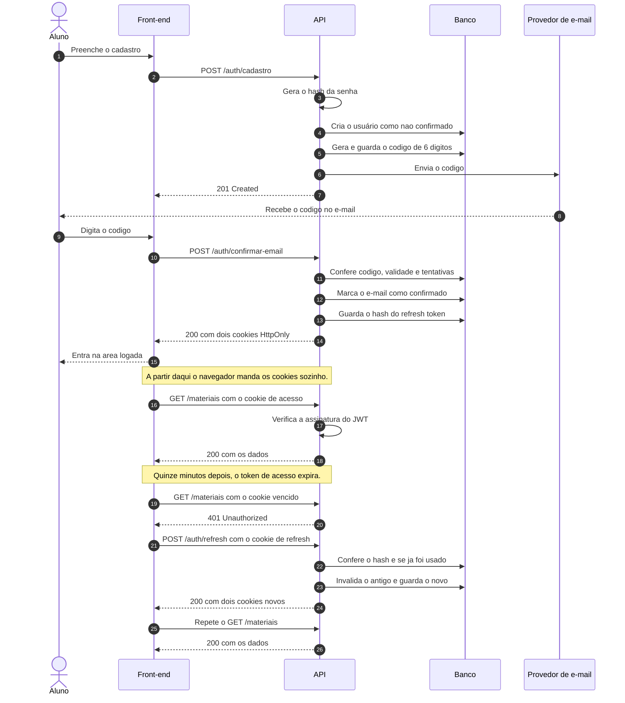

# Como a autenticação funciona no Your Journey

> Documento de referência para o time. Ele explica do zero, porque esta é a parte mais
> difícil do projeto e a que mais dá errado quando alguém copia código sem entender.
>
> Leia antes de pegar qualquer issue de autenticação.

## Sumário

1. [O problema que estamos resolvendo](#1-o-problema-que-estamos-resolvendo)
2. [Senha: nunca guardamos a senha](#2-senha-nunca-guardamos-a-senha)
3. [Confirmação de e-mail](#3-confirmação-de-e-mail)
4. [O que é um JWT](#4-o-que-é-um-jwt)
5. [Por que dois tokens, e não um](#5-por-que-dois-tokens-e-não-um)
6. [Por que cookie, e não localStorage](#6-por-que-cookie-e-não-localstorage)
7. [SameSite, CORS e credentials](#7-samesite-cors-e-credentials)
8. [O fluxo completo](#8-o-fluxo-completo)
9. [Rotação e detecção de reúso](#9-rotação-e-detecção-de-reúso)
10. [Decisões deste projeto, em uma tabela](#10-decisões-deste-projeto-em-uma-tabela)
11. [Erros comuns](#11-erros-comuns)
12. [Para ler depois](#12-para-ler-depois)
13. [Glossário](#13-glossário)

---

## 1. O problema que estamos resolvendo

**HTTP não lembra de nada.** Cada requisição chega ao servidor sem nenhuma memória da
anterior. Se o aluno fez login há dois segundos, a próxima requisição dele chega
igualzinha à de um desconhecido.

Então toda requisição precisa **provar quem é**, sozinha. Autenticação é o conjunto de
truques para fazer isso sem pedir a senha de novo a cada clique.

---

## 2. Senha: nunca guardamos a senha

Guardamos um **hash** dela.

Um hash é uma função de mão única: dá para transformar `minhasenha123` em
`$2b$12$K4x...`, e não dá para voltar. Quando o aluno faz login, transformamos o que ele
digitou e comparamos os dois hashes. Se batem, a senha está certa. Em momento nenhum a
senha original existe no nosso banco.

Por que isso importa: se o banco vazar, e bancos vazam, quem pegou o dump não tem as
senhas dos alunos. E como muita gente repete senha entre sites, um vazamento nosso
viraria um problema na conta de e-mail e no banco dessa pessoa.

**Duas regras que não se negociam:**

- Use um algoritmo feito para senha: **bcrypt**, **scrypt** ou **argon2**. Nunca MD5,
  nunca SHA-256 puro. Esses últimos são rápidos de propósito, e rapidez aqui é defeito:
  quanto mais rápido, mais tentativas por segundo quem atacar consegue fazer.
- Cada senha recebe um **salt**, um valor aleatório misturado antes do hash. É o que
  impede que duas pessoas com a mesma senha tenham o mesmo hash. As bibliotecas acima já
  fazem isso sozinhas.

---

## 3. Confirmação de e-mail

Depois do cadastro, mandamos um código de 6 dígitos para o e-mail informado. Enquanto o
aluno não digitar esse código, a conta existe mas não entra.

Isso resolve dois problemas de uma vez: prova que o e-mail existe de verdade, e prova
que é daquela pessoa. Sem isso, alguém cadastra `professor@escola.com` e passa a receber
o material de estudo de outra pessoa.

**Isto não é autenticação em dois fatores.** Segundo fator acontece em todo login.
Confirmação de e-mail acontece uma vez só, no cadastro. O produto não tem segundo fator.

O código precisa de três proteções:

| Proteção | Por quê |
| --- | --- |
| **Expira** em poucos minutos | Um código que vale para sempre é uma segunda senha, e que fica parada na caixa de entrada |
| **Limite de tentativas** | Com tentativas infinitas, 6 dígitos são só um milhão de chutes, o que um programa faz em minutos |
| **Limite de reenvio** | Sem isso, alguém usa nosso servidor para inundar a caixa de entrada de outra pessoa |

---

## 4. O que é um JWT

**JWT** quer dizer *JSON Web Token*. É um texto que carrega informação e vem **assinado**
pelo servidor.

Ele tem três partes separadas por ponto:

```
eyJhbGciOiJIUzI1NiJ9  .  eyJzdWIiOiI0MiIsImV4cCI6MTc...  .  hQ3f9Yy...
      cabeçalho                     conteúdo                  assinatura
```

- **Cabeçalho**: qual algoritmo assinou.
- **Conteúdo**: os dados. No nosso caso, o id do usuário e a hora de expiração.
- **Assinatura**: a prova de que fomos nós que emitimos.

**O ponto que quase todo mundo entende errado:** as duas primeiras partes **não são
criptografadas**. São só texto embaralhado em base64, e qualquer pessoa consegue ler.
Cole um JWT em <https://jwt.io> e veja o conteúdo aparecer.

Duas consequências práticas:

- **Nunca coloque segredo dentro de um JWT.** Nada de senha, nada de dado sensível.
- **A assinatura é o que importa.** Ela garante que ninguém alterou o conteúdo. Se
  alguém trocar o id de usuário para virar outra pessoa, a assinatura deixa de bater e
  o servidor recusa.

E a regra que decorre disso: **sempre verifique a assinatura**. Ler o conteúdo de um JWT
sem conferir a assinatura é o mesmo que acreditar em qualquer um que diga ser o diretor.

---

## 5. Por que dois tokens, e não um

Aqui mora a parte que confunde.

Se o token de acesso durasse 30 dias, seria cômodo, e seria ruim: quem roubasse o token
teria 30 dias de acesso livre, e não teríamos como cancelar. JWT é assinado, não
consultado: uma vez emitido, o servidor não tem como dizer "esse aí não vale mais" sem
guardar uma lista, o que joga fora a vantagem dele.

Se durasse 5 minutos, seria seguro, e seria insuportável: o aluno teria que fazer login
o tempo todo.

A saída é usar **dois tokens com papéis diferentes**:

| | Token de acesso | Refresh token |
| --- | --- | --- |
| **Serve para** | Provar quem é, a cada requisição | Pedir um novo token de acesso |
| **Vale por** | Minutos | Dias |
| **Vai em** | Toda requisição | Só na rota de renovação |
| **Guardado no banco?** | Não, é só assinado | Sim, em hash, para poder revogar |
| **Se vazar** | O estrago acaba em minutos | Dá para revogar na hora |

O de acesso é curto porque circula muito. O de refresh é longo porque circula pouco, e
como fica guardado no banco, dá para cancelar quando o aluno sai da conta ou quando
desconfiamos de algo.

---

## 6. Por que cookie, e não localStorage

Muita gente guarda token em `localStorage`. Funciona, e é inseguro.

**O motivo é o XSS.** *Cross-Site Scripting* é quando alguém consegue rodar JavaScript
dentro da nossa página, por exemplo através de um campo de texto que não foi tratado.
Esse JavaScript lê o `localStorage` inteiro e manda o token embora. O aluno não percebe
nada.

Um cookie marcado **`HttpOnly`** não é legível por JavaScript. Nem o nosso, nem o de
quem atacou. O navegador o guarda e o envia sozinho nas requisições, e nenhum script
consegue ler o valor.

As marcas que usamos em cada cookie:

| Marca | O que faz |
| --- | --- |
| `HttpOnly` | JavaScript não consegue ler. É a proteção contra XSS. |
| `Secure` | Só viaja por HTTPS. Em desenvolvimento fica desligada, porque localhost é HTTP. |
| `SameSite=Lax` | Não é enviado em requisição vinda de outro site. É a proteção contra CSRF. |
| `Path` | Em qual caminho o cookie é enviado. O de refresh só vai para a rota de renovação. |
| `Max-Age` | Quanto tempo o cookie vive. |

Restringir o `Path` do refresh token é uma proteção barata e real: ele deixa de trafegar
em toda requisição e passa a aparecer só onde é necessário. Menos viagens, menos chance
de vazar.

---

## 7. SameSite, CORS e credentials

Três coisas que parecem a mesma e não são.

**CSRF** (*Cross-Site Request Forgery*) é quando um site malicioso faz o navegador da
vítima disparar uma requisição para o nosso servidor. Como o navegador manda os cookies
sozinho, a requisição chega autenticada. `SameSite=Lax` corta isso: o cookie não é
enviado quando a requisição parte de outro site.

**CORS** (*Cross-Origin Resource Sharing*) é o contrário: é o navegador impedindo que a
nossa página leia a resposta de um servidor de origem diferente, a menos que o servidor
autorize. Nosso front está em `localhost:3000` e a API em `localhost:8080`: origens
diferentes, então a API precisa autorizar explicitamente.

**`credentials`** é o que liga os dois. Por padrão, `fetch` para outra origem **não
manda cookie**. Para mandar, é preciso combinar os dois lados:

```ts
// No front
fetch(url, { credentials: 'include' });
```

```ts
// Na API
app.enableCors({ origin: 'http://localhost:3000', credentials: true });
```

E aqui tem uma armadilha: com `credentials: true`, o navegador **recusa** `origin: '*'`.
A origem precisa ser explícita. É por isso que a API lê `WEB_BASE_URL` do ambiente em
vez de liberar tudo.

> **Uma boa notícia para o desenvolvimento local:** `localhost:3000` e `localhost:8080`
> são portas diferentes, então são origens diferentes para o CORS, mas o mesmo *site*
> para o `SameSite`. Ou seja, `SameSite=Lax` funciona local sem gambiarra.

---

## 8. O fluxo completo



**O que este diagrama mostra.** O cadastro termina sem sessão nenhuma: o aluno só entra
depois de confirmar o e-mail. A partir daí ele não faz mais nada consciente sobre
autenticação, porque o navegador envia os cookies sozinho.

A parte de baixo é a que justifica os dois tokens. Quando o token de acesso vence, o
front recebe `401`, chama a rota de renovação e repete a requisição original. **O aluno
não percebe nada**, e não precisa fazer login de novo. Isso continua funcionando por
dias, até o refresh token vencer.

---

## 9. Rotação e detecção de reúso

Cada vez que o refresh token é usado, ele é **queimado** e um novo é emitido. Isso se
chama rotação.

E aqui vem o truque bonito: se um refresh token **já usado** aparecer de novo, algo está
errado. Ou alguém copiou o token, ou o aluno está usando uma cópia antiga. O servidor não
tem como saber qual dos dois é o legítimo.

A resposta correta é **invalidar toda a família de tokens daquele usuário**, forçando um
login novo. É chato para o aluno e é o certo: no caso ruim, corta o acesso de quem
roubou; no caso bom, custa um login.

---

## 10. Decisões deste projeto, em uma tabela

| Decisão | Valor | Por quê |
| --- | --- | --- |
| Hash de senha | bcrypt ou argon2 | Feitos para senha, lentos de propósito |
| Token de acesso | JWT, 15 minutos | Curto porque circula em toda requisição |
| Refresh token | Opaco, 7 dias, hash no banco | Longo, revogável, circula pouco |
| Transporte | Cookies `HttpOnly` | JavaScript não lê, então XSS não rouba |
| `SameSite` | `Lax` | Corta CSRF sem quebrar o desenvolvimento local |
| `Secure` | Ligado fora de desenvolvimento | Localhost é HTTP |
| `Path` do refresh | Só a rota de renovação | Menos viagens, menos exposição |
| Rotação | A cada uso, com detecção de reúso | Limita o estrago de um token roubado |
| Código de confirmação | 6 dígitos, expira, com limite de tentativas e de reenvio | Sem isso, é chutável e vira ferramenta de spam |

Os valores exatos de tempo e de limite ficam em variáveis de ambiente, não no código.

---

## 11. Erros comuns

- **Ler o JWT sem verificar a assinatura.** Bibliotecas costumam ter `decode` e
  `verify`. `decode` só abre; `verify` confere. Use `verify`, sempre.
- **Guardar o refresh token em texto puro no banco.** Ele é uma credencial. Guarde o
  hash, do mesmo jeito que a senha.
- **Devolver mensagem de erro específica no login.** "Esse e-mail não existe" entrega
  quem tem conta no sistema. A mensagem é sempre a mesma para e-mail errado e para senha
  errada.
- **Esquecer o `credentials: 'include'` no front.** O cookie simplesmente não vai, e o
  sintoma é um `401` que parece bug do backend.
- **Usar `origin: '*'` com `credentials: true`.** O navegador recusa a combinação, e a
  mensagem de erro não é óbvia.
- **Deixar o token de acesso durar horas** porque renovar dá trabalho. É trocar a única
  proteção que o token curto oferece pela conveniência de quem programa.

---

## 12. Para ler depois

Fontes primárias, em ordem de utilidade para este projeto:

- [OWASP: Authentication Cheat Sheet](https://cheatsheetseries.owasp.org/cheatsheets/Authentication_Cheat_Sheet.html)
- [OWASP: Password Storage Cheat Sheet](https://cheatsheetseries.owasp.org/cheatsheets/Password_Storage_Cheat_Sheet.html)
- [OWASP: Session Management Cheat Sheet](https://cheatsheetseries.owasp.org/cheatsheets/Session_Management_Cheat_Sheet.html)
- [MDN: Set-Cookie](https://developer.mozilla.org/pt-BR/docs/Web/HTTP/Reference/Headers/Set-Cookie)
- [MDN: SameSite](https://developer.mozilla.org/pt-BR/docs/Web/HTTP/Reference/Headers/Set-Cookie#samesitesamesite-value)
- [MDN: CORS](https://developer.mozilla.org/pt-BR/docs/Web/HTTP/Guides/CORS)
- [NestJS: Authentication](https://docs.nestjs.com/security/authentication)
- [jwt.io](https://jwt.io) — cole um token e veja o conteúdo aparecer. Faça isso uma vez,
  ajuda a entender que o conteúdo não é secreto.

---

## 13. Glossário

| Termo | Significado |
| --- | --- |
| **Argon2 / bcrypt** | Algoritmos de hash feitos para senha, lentos de propósito. |
| **CORS** | Regra do navegador sobre ler resposta de outra origem. |
| **CSRF** | Ataque em que outro site faz o navegador da vítima chamar a nossa API. |
| **Hash** | Transformação de mão única. Dá para ir, não dá para voltar. |
| **HttpOnly** | Marca de cookie que impede JavaScript de ler o valor. |
| **JWT** | Token assinado que carrega dados legíveis por qualquer um. |
| **Refresh token** | Credencial longa, usada só para obter um novo token de acesso. |
| **Rotação** | Queimar o refresh token a cada uso e emitir um novo. |
| **Salt** | Valor aleatório misturado à senha antes do hash. |
| **SameSite** | Marca de cookie que controla envio em requisição vinda de outro site. |
| **Token de acesso** | Credencial curta, enviada em toda requisição. |
| **XSS** | Ataque em que alguém consegue rodar JavaScript na nossa página. |
